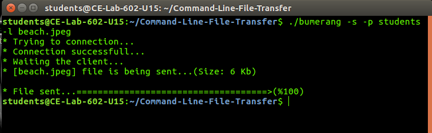
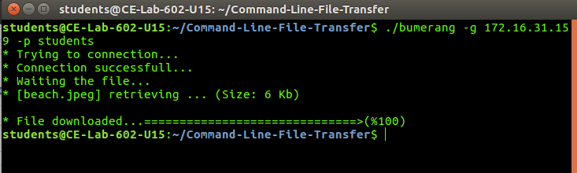

TE COMPS Batch "E" Group - 2
====================================

Swati Bamble - 2018230066

Palak Davda - 2018230068
Divya Gavandi - 2018230070
Anisha Gharat - 2018230071
Leena Shinde - 2018230076
Tejashri Wagh - 2018230077

Command Line Tool for File Transfer
=====================================

This project is aimed to create a command line tool for transfer of files. A user can transfer different types of files with the following extensions:
1. .txt
2. .doc
3. .pdf
4. .pptx
5. .xls
6. .out
7. .c
8. .cpp
9. .java
10. .py
11. .sh
12. .csv
13. .arff
14. .png
15. .jpeg
16. .jpg

Screenshot
==========
Server:

Client:

User Guidelines
================
1. User will have to clone the repository.
2. While inside the folder path in command line, user must use the "make" command to make an executable of the project.
3. Then user needs to know the IP address of the server from whom the client is requesting for any file.
4. Command line commands:
   Server side -
   ./bumerang -s -p [system password] -l ...[filepath]/[filename with extension]
   Client side -
   ./bumerang -g [server ip address] -p [system password] 
